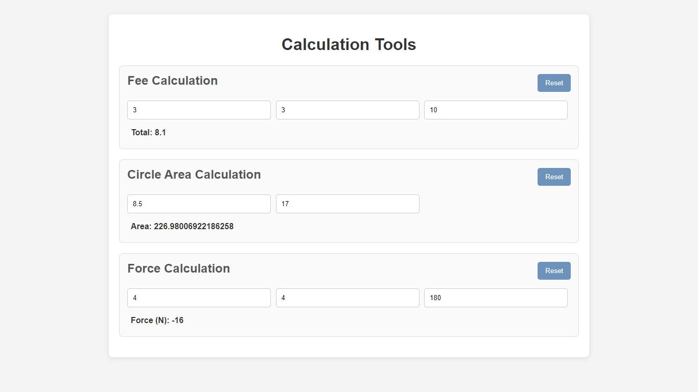

# گزارشی از اجزای اصلی و روند انجام تمرین نخست برنامه‌سازی وب

پاسخ تمرین از سه فایل HTML، فایل CSS و JavaScript تشکیل شده است که در هر گام به بخش‌های اصلی هر کدام از آن‌ها و نحوه‌ی انجام کار می‌پردازیم.

## ۱. فایل HTML

ساختار صفحه در این فایل مشخص می‌شود که شامل سه div اصلی است، که خود در یک بخش دیگر است، و در هر کدام از آن‌ها بخش‌های هر یک از فرمول‌ها قرار دارد. در هر بخش ورودی‌ها با المان‌های input از کاربر دریافت می‌شوند که این ورودی‌های به عدد محدود شده‌اند و هم‌چنین بازه‌ی مورد قبول آن‌ها مشخص شده است. خروجی نیز به عنوان یک متن نمایش داده می‌شود. هم‌چنین دکمه‌ای برای پاک شدن مقادیر و برگشت به حالت نخستین قرار داده شده است. (بخش‌هایی از خود این divها نیز ممکن است در بخش‌های دیگری قرار گرفته باشند که به دلیل نمایش بهتر و زیباتر بوده است و به آن‌ها نمی‌پردازیم.)

فرمول ابتدایی همان است که در مثال تمرین آمده است؛ با این تفاوت که تخفیف به شکل درصدی لحاظ شده است. هم‌چنین با تغییر مقادیر به‌سادگی می‌توان مشاهده کرد که مقدار خروجی در لحظه تغییر می‌کند. دو فرمول دیگر نیز به‌ترتیب محاسبه‌ی مساحت دایره و مقدار نیرو است. در مورد دوم امکان وارد کردن هر کدام از قطر و شعاع وجود دارد و این مقادیر با هم‌دیگر هماهنگ می‌شوند.

هم‌چنین در صورتی که فرمولی که در فایل وجود دارد را به شکلی تغییر دهیم که غیر قابل قبول شود، پیغام مربوط به آن را مشاهده می‌کنیم و تمامی ورودی‌ها و کلید مربوط به آن فرمول نیز غیر فعال می‌شوند.

## ۲. فایل CSS

در این فایل دستورات لازم برای نمایش بهتر و زیباتر بخش‌های صفحه قرار گرفته است. کلیات نحوه‌ی قرارگیری اجزاء و رنگ‌بندی آن‌ها توسط ابزارهای هوش مصنوعی انجام شده است که بعداً تغییرات مورد نیاز برای بهبود رنگ‌بندی و فاصله‌ی اجزاء اعمال شده است. برای مثال تغییر رنگ دکمه‌ی ریست تا با دیگر بخش‌ها سازگارتر باشد و در یک flex قرار دادن آن با تیتر بخش هر فرمول.

از نکات مهمی که نیاز است به آن اشاره شود قابیلتی است که برای responsive بودن صفحه قرار داده شده است؛ که برای اندازه‌های مختلف صفحه و یا در هنگام تغییر اندازه‌ی اجزاء در اثر بزرگ/کوچک‌نمایی نحوه‌ی قرارگیری آن‌ها تغییر می‌کند. برای مثال ورودی‌های کاربر به‌جای این‌که در کنار هم قرار گیرند در زیر هم قرار می‌گیرند.

```css
@media only screen and (min-width: 500px) and (max-width: 1000px) {
    input {
        width: 43%;
    }
}

@media only screen and (max-width: 500px) {
    input {
        width: 90%;
    }
}

@media only screen and (max-width: 400px) {
    .header-group {
        display: block;
    }

    h2 {
        display: block;
    }
}
```

## ۳. فایل JS

در این فایل تابع‌های مورد نیاز برای تغییر صفحه در صورت نیاز قرار گرفته است. ابتدا یک تابع ()reset وجود دارد که در هنگام کلیک شدن بر روی دکمه عمل می‌کند و برحسب این‌که در بخش کدام یک از فرمول‌ها باشد ورودی‌ها و خروجی آن را پاک می‌کند.

سپس برای هر کدام از فرمول‌ها یک تابع تعریف کرده‌ایم تا eventListener ورودی‌ها و خروجی متناظر را مشخص کنند. در هر بخش ابتدا المان‌های ورودی مربوطه را دریافت کرده‌ایم. سپس در یک try-catch درستی فرمول بررسی شده است. اگر فرمول ایراد داشته باشد و به خطایی بربخوریم تمامی ورودی‌ها و خروجی مربوط به آن فرمول را غیرفعال می‌کنیم و، همان‌طور ک خواسته شده، عبارت Invalid Function را چاپ می‌کنیم. اگر فرمول درست باشد نیز برای هر یک از ورودی‌ها در دو حالت input و change یک eventListener تعریف می‌کنیم که در هر کدام ابتدا مقادیر مورد نیاز را در متغیرها قرار می‌دهیم و سپس تابع eval را صدا می‌کنیم تا محاسبه انجام شود و درنهایت مقدار چاپ‌شده را به‌روزرسانی می‌کنیم.

ما نیاز داریم که این سه تابع پس از بارگیری صفحه، بارگیری شوند تا ایتدا المان‌ها مشخص شده باشند. پس آن‌ها را در تابعی قرار می‌دهیم که در window.onload فعال می‌شود. درنتیجه پس از بارگیری صفحه این توابع نیز set می‌شوند.

در زیر نمونه‌ای از کارکرد این صفحه آورده شده است.



